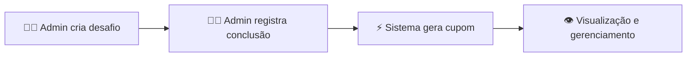

# 📋 Regras de Negócio Essenciais - MentorPoints API

> Sistema para gerenciar desafios que geram cupons para alunos, com controle de acesso por perfil.

---

## 🔐 1. CONTROLE DE ACESSO

### 👨‍💼 Apenas administradores podem:
- Criar/editar/remover desafios
- Registrar conclusão de desafios
- Criar prêmios
- Listar alunos
- Remover cupons

### 👨‍🎓 Alunos podem apenas visualizar:
- Desafios de sua turma
- Cupons próprios e da turma
- Prêmios disponíveis

## 👤 2. USUÁRIOS

- **RN01** - Email deve ser único no sistema
- **RN02** - Alunos devem ter turma obrigatória, administradores não
- **RN03** - Senhas são criptografadas e nunca expostas
- **RN04** - Token JWT válido por 24 horas para autenticação

## 🎯 3. DESAFIOS

- **RN07** - Desafios devem ter título, descrição e turma
- **RN08** - Cada desafio pertence a uma turma específica
- **RN09** - Conclusão de desafio requer: usuário, desafio e título (validação de segurança)
- **RN10** - Cupom é gerado automaticamente na conclusão válida

## 🎫 4. CUPONS

- **RN11** - Cupons são criados APENAS pela conclusão de desafios
- **RN12** - Cada cupom vincula: usuário + desafio + equipe (opcional)
- **RN13** - Listagem por turma inclui nome do aluno
- **RN14** - Administradores nunca aparecem em listagens de cupons

## 🏆 5. PRÊMIOS

- **RN15** - Prêmios devem ter nome e descrição
- **RN16** - Qualquer usuário autenticado pode visualizar prêmios

## ⚙️ 6. INTEGRIDADE

- **RN17** - Título do desafio deve ser confirmado na conclusão (evita erros)
- **RN18** - Todas as operações filtram por turma quando aplicável

---

## 🔄 FLUXO PRINCIPAL DO NEGÓCIO

1. **🧑‍💼 Admin cria desafio** para uma turma específica
2. **🧑‍💼 Admin registra conclusão** do aluno (com validação de título do desafio)
3. **⚡ Sistema gera cupom** automaticamente para o aluno
4. **👁️ Cupons podem ser visualizados** por alunos da turma e gerenciados por admins

---

## 🚨 VALIDAÇÕES CRÍTICAS QUE O SISTEMA DEVE GARANTIR

### ❌ **NÃO PODE ACONTECER:**
- ❌ Criar usuário aluno sem turma
- ❌ Dois usuários com mesmo email
- ❌ Aluno acessar funcionalidades de admin
- ❌ Cupom criado sem conclusão de desafio
- ❌ Admin aparecer em listagem de alunos
- ❌ Conclusão de desafio sem validação de título

### ✅ **DEVE SEMPRE ACONTECER:**
- ✅ Criptografia de todas as senhas
- ✅ Filtro por turma em operações relevantes
- ✅ Geração automática de cupom na conclusão
- ✅ Validação de token em endpoints protegidos
- ✅ Conversão consistente de dados para string

---

### 📊 Resumo das Regras

| Categoria | Quantidade de Regras |
|-----------|---------------------|
| 👤 Usuários | 4 regras |
| 🔐 Controle de Acesso | 2 regras |
| 🎯 Desafios | 4 regras |
| 🎫 Cupons | 4 regras |
| 🏆 Prêmios | 2 regras |
| ⚙️ Integridade | 4 regras |
| **📋 Total** | **20 regras** |

---

**📅 Atualizado em: 29 de outubro de 2025**

*MentorPoints API - Sistema de Gamificação Educacional*

